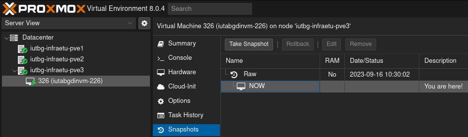

# Introduction
Ce TP a pour but de vous faire découvrir la prise en main du système le plus populaire dans l’hébergement Web, GNU/Linux, dans sa distribution la plus courante, Debian. Vous déploierez des services omniprésents sur Internet (Apache, MariaDB, SSH…).

Ces compétences sont couramment demandées dans le monde professionnel, dans le cadre de la mise en production d’application web. Elles vous permettront, soit de faire la mise en œuvre par vous-même, soit d’avoir une bonne communication avec l’administrateur système de votre organisation.
### Mise en situation
Vous venez d’être embauché dans une TPE, et le lead dev (qui est aussi le patron, l'équipe marketing et la RH) vous demande de mettre en place un bug tracker, parce qu'on va pas embaucher un adminsys pour ça quand même nan mais t'est informaticien ou pas ? Vous devrez donc réaliser la mise en production de **"Mantis Bug Tracker"**.  
  
#### Consignes
J'ai découpé la mise en prod' en étapes logiques, mais c'est bien vous qui devrez **trouver ce qu'il est nécessaire de faire**. Votre mémoire vous remerciera. Vous aurez, au fur et à mesure **des soucis technique**, propre à vos choix. Résolvez-les ou posez moi des questions, mais toujours **documentez**.
### Moyens
#### à l'IUT
Vous disposerez d’un serveur GNU/Linux sous la distribution Debian la plus récente et d’un accès via une interface web, qui est en fait une **VM sous ProxMox** (miam)  

Grâce à mon incroyable mansuétude, vous aurez la possibilité de faire des "snapshots" de votre VM. **Servez-vous en**. Faites en un de suite, d'ailleurs, vous risquez d'en avoir besoin plus vite que vous ne l'imaginez …

En client, vous pouvez utiliser votre VM Linux "Desktop", un PC Windows en salle, votre PC Perso, etc. Prenez ce avec lequel vous êtes le plus à l'aise.
#### à la maison
Si vous voulez reproduire ce TP à la maison, vous n'avez pas beaucoup de choix, il faudra passer par une VM, ( par exemple, _virtual box, VMWare workstation, QEMU KVM ..._). Je vais pas vous faire un tuto pour les VM si ?!
### Important
Vous **documenterez** tout. Mot de passe, doc sur internet, commande exotique, chemin de fichiers … Tout est potentiellement pertinent. A la fin du TP, vous devriez être capable de confier ces notes a un tiers, sans le support de cours, et il doit pouvoir se débrouiller avec votre serveur. Vous serez évalué sur cette capacité à réaliser une mise en production, mais aussi à documenter.

[02-Prise en main du serveur](./CoursApache/Chapitres/02-Prise%20en%20main%20du%20serveur.md)

